### Hi there 👋 
### Bonjour!Hola!你好!こんにちは!

### 千代有希=>ですにゃ ฅ⁠^⁠•⁠ﻌ⁠•⁠^⁠ฅ.

### Language

- [x] zh-CN & zh-TW
- [x] en-UK & en-US (**NOT** good at)
- [ ] ja-JP (学ぶ)
- [x] Markdown
- [x] Typst (learning)
- [x] C/C++ (a little)
- [x] Haskell (learning)
- [ ] Rocq (plan to learn)
- [ ] Lean (plan to learn

### Math learning plan

#### Part 1

- [ ] Single Variable Calculus
- [ ] Multivarible Calculus
- [ ] Differential Equations
- [ ] Complex Variables with Applications
- [ ] Ordinary Differential Equations
- [ ] Partial Differential Equations
- [ ] Numerical Solutions of Partial Differential Equations
- [ ] Differential Geometry

#### Part 2

- [ ] Linear Algebra
- [ ] Abstract Algebra
- [ ] Elementary Number Theory
- [ ] Introduction To Probability And Statistics
- [ ] Basic Topology
- [ ] Real Analysis
- [ ] Functional Analysis
- [ ] Stochastic Process

### [About me?](https://chiyoyuki.uk/about/)

半死不死的预备三和大神

